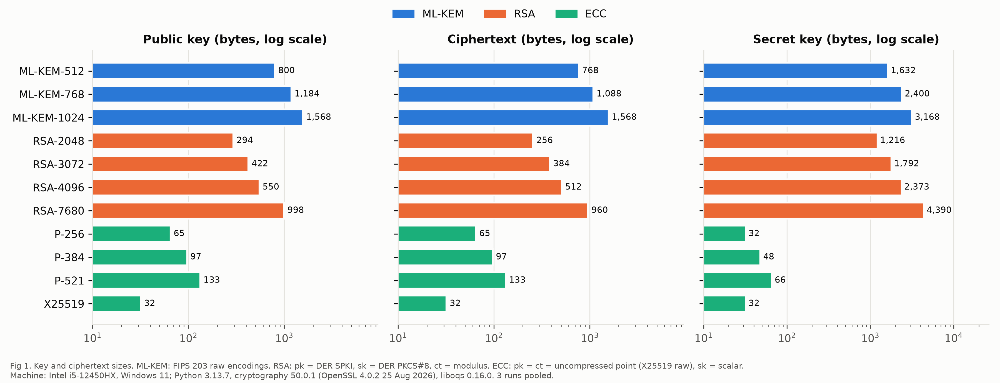
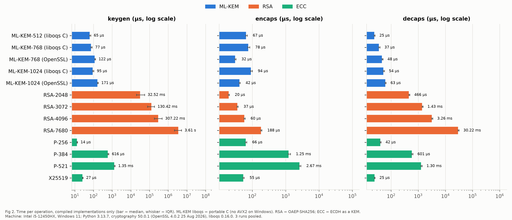
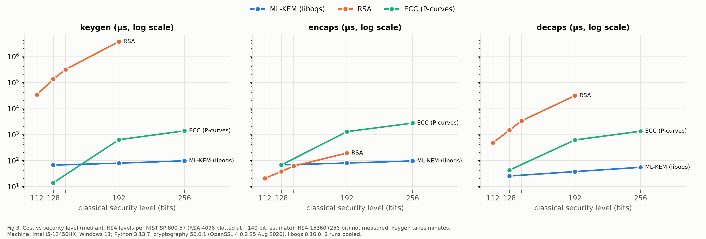
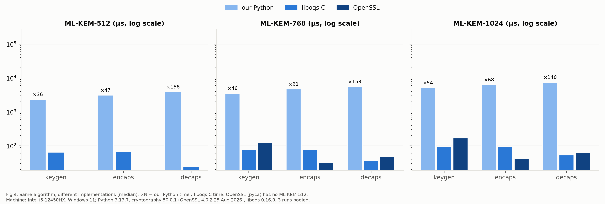
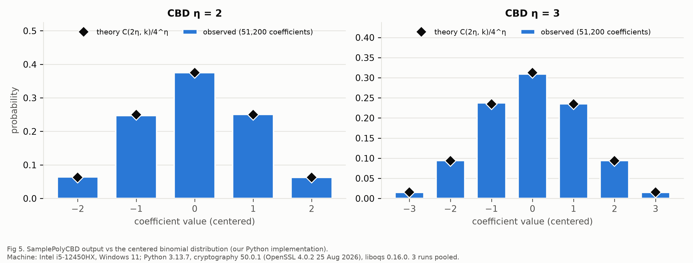
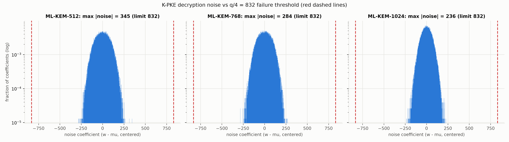
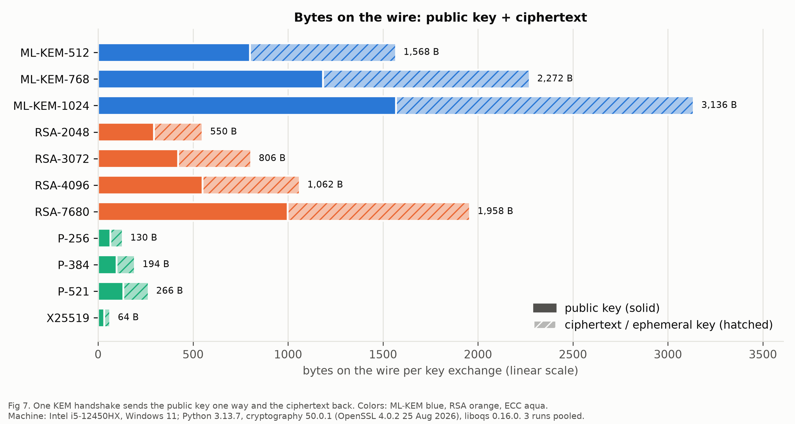

# Results: what each file and chart shows

Everything here was produced on one laptop (Intel i5-12450HX, Windows 11,
plugged in, "Best performance" mode) by the scripts in `../bench/`.
Machine and library versions: [`machine.txt`](machine.txt) and [`bench_meta.json`](bench_meta.json).

**Colors in every chart:** blue = ML-KEM (post-quantum), orange = RSA, aqua = ECC.
**Log scale** means each grid line is 10× the one before, so a bar one grid line
longer is 10× bigger.

## Headline findings

1. **Our ML-KEM is correct:** it passes all **240/240** official NIST test vectors
   ([`acvp_test_output.txt`](acvp_test_output.txt)) and works with two
   independent professional implementations (liboqs and OpenSSL).
2. **ML-KEM is fast:** a full ML-KEM-768 key exchange takes about **0.19 ms**
   (liboqs C). RSA at the same security level (RSA-7680) takes **3.6 s**, and
   ECC P-384 takes **2.5 ms**.
3. **ML-KEM is big:** it sends **2,272 bytes** per key exchange (ML-KEM-768)
   vs **64 bytes** for X25519. Its main cost is bandwidth, not speed.
4. **Implementation matters:** our pure-Python version is 36-158× slower than C
   for the same algorithm. That is why the RSA/ECC comparison uses C libraries.

## The charts

### Fig 1: key and ciphertext sizes

ML-KEM keys and ciphertexts (blue) are around 1 KB: bigger than ECC (tens of
bytes) and similar to or bigger than RSA.

### Fig 2: time per operation (compiled C code only)

Bar = median time; the small whisker = middle 50% of measurements. ML-KEM is
fast in all three operations. RSA key generation is extremely slow (ms to
seconds). RSA *encryption* is fast, which is the one place RSA competes.

### Fig 3: how cost grows with security level

Moving from 128-bit to 256-bit security barely changes ML-KEM's cost (~1.5×),
while RSA and ECC get much slower. (RSA-15360, the 256-bit RSA size, was not
measured: making one key takes minutes.)

### Fig 4: our Python code vs optimized C

Same algorithm, three implementations. "×N" = how many times slower our
Python code is than liboqs C. OpenSSL has no ML-KEM-512.

### Fig 5: the random noise has the right shape

ML-KEM adds small random "noise" numbers (from -2 to 2, or -3 to 3). Bars are
what our code produced; black diamonds are what the math says to expect. They match.

### Fig 6: why decryption practically never fails

After decrypting, some leftover noise remains. Decryption would only fail if it
crossed the red dashed line (832). In 300 decryptions per parameter set it never
got past 345, i.e. less than half the limit.

### Fig 7: bytes sent over the network per key exchange

Solid = public key, hatched = ciphertext. This is the practical cost of
post-quantum security.

## Data files

| File | Contents |
|---|---|
| [`bench.csv`](bench.csv) | Every benchmark number: one row per scheme / implementation / operation (median, quartiles, ops per second, sizes, memory, estimated cycles) |
| [`bench_tables.md`](bench_tables.md) | The same numbers as readable tables, ready to paste into the report |
| [`bench_runs.csv`](bench_runs.csv) | Median from each of the 3 runs separately (shows the numbers are stable) |
| [`bench_meta.json`](bench_meta.json) | Date, machine, library versions, and how things were measured |
| [`profile_mlkem.csv`](profile_mlkem.csv) | Where our Python ML-KEM spends its time (noise sampling ~30%, encoding ~20-25%, ...) |
| [`kpke_noise.csv`](kpke_noise.csv) | Numbers behind Fig 6 |
| [`acvp_test_output.txt`](acvp_test_output.txt) | Output of the 240 NIST test-vector checks (all PASSED) |
| [`machine.txt`](machine.txt) | Laptop specs and library versions |

## How to regenerate

From `mlkem/`, with the venv active:

```bash
python bench/run_all.py        # benchmarks -> bench.csv (~10-25 min; laptop plugged in, Best performance)
python bench/profile_mlkem.py  # profile_mlkem.csv
python bench/plots.py          # all 7 charts + bench_tables.md
```
